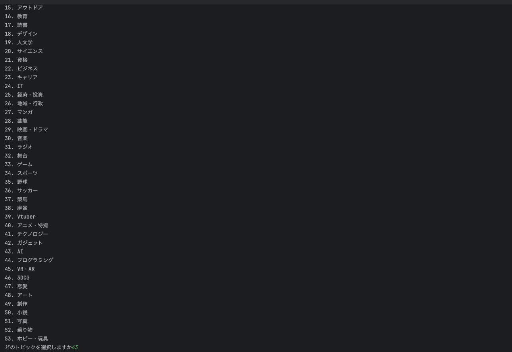
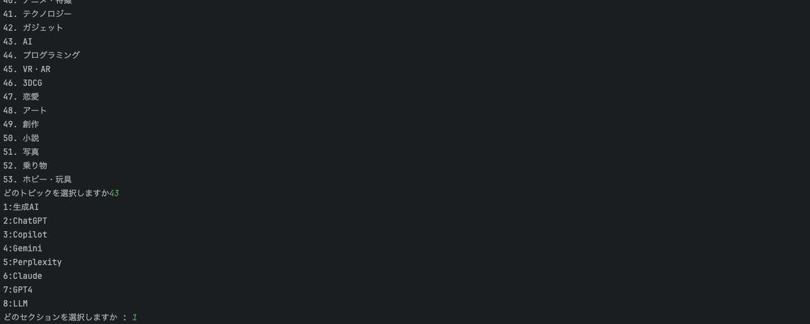
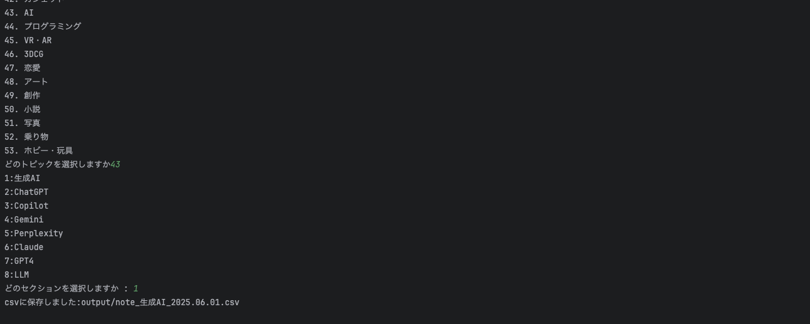
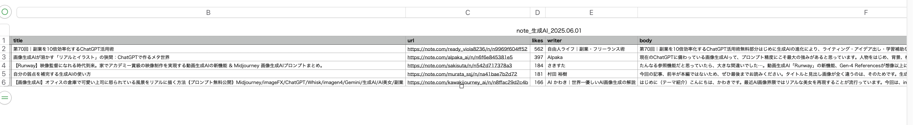

# 📘 note_scraper

スクレイピング学習のために作成しています。

noteの人気記事をジャンル別に自動収集し、CSV形式で保存できるスクレイピングツールです。

## 📝 概要

このツールは、[note](https://note.com/)の「トピック」から任意のジャンル（細分類）を選択し、**人気記事を自動で収集**してCSVファイルに保存します。  
プログラミング初心者でも実行しやすい構成になっており、**日々の情報収集や分析、アウトプットの素材収集**に活用できます。

### 🔍 主な機能

- noteのトピックと細分化セクションをCLIから選択
- 各記事のタイトル・URL・著者・いいね数・本文冒頭200文字を自動取得
- いいね数順に並べて上位5件をCSVに保存
- 保存先の `output` フォルダは自動作成
- Selenium + BeautifulSoup による自動ブラウザ操作

## 📸 デモ

> 1.トピックの選択

> 2.ジャンルの選択

> 3.csv保存に成功した場合

> 4.csvの内容


## 🛠 インストール方法

Python 3.10 以上を推奨。

```bash
# 仮想環境の作成と有効化（任意）
python3 -m venv .venv
source .venv/bin/activate  # Windowsは .venv\Scripts\activate

# ライブラリのインストール
pip install -r requirements.txt

# 実行
python main.py
```
## 📂 ディレクトリ構成
```bash
note_scraper/
├── get_topic.py
├── get_section.py
├── get_top_5.py
├── get_body.py
├── to_csv.py
├── main.py
├── output/              # CSVの出力先
├── requirements.txt
└── README.md
```
## ⚠️ 現状の課題・今後の改善
- 記事要約をAIで生成（現在は冒頭200文字）
- トピック選択の履歴による表示順の最適化（JSONによるカスタマイズ）
- GUI対応（Tkinterなど）

## 🙌 貢献の方法（今後の課題）

まだ他の開発者との連携経験がありませんが、今後よりよいツールにしていくため、以下のような貢献を歓迎する予定です：

- 機能の追加・改善
- READMEやドキュメントの整備
- バグの報告や修正

## ライセンス

このプロジェクトは MIT ライセンスのもとで公開されています。  
詳しくは [LICENSE](./LICENSE) ファイルをご覧ください。
